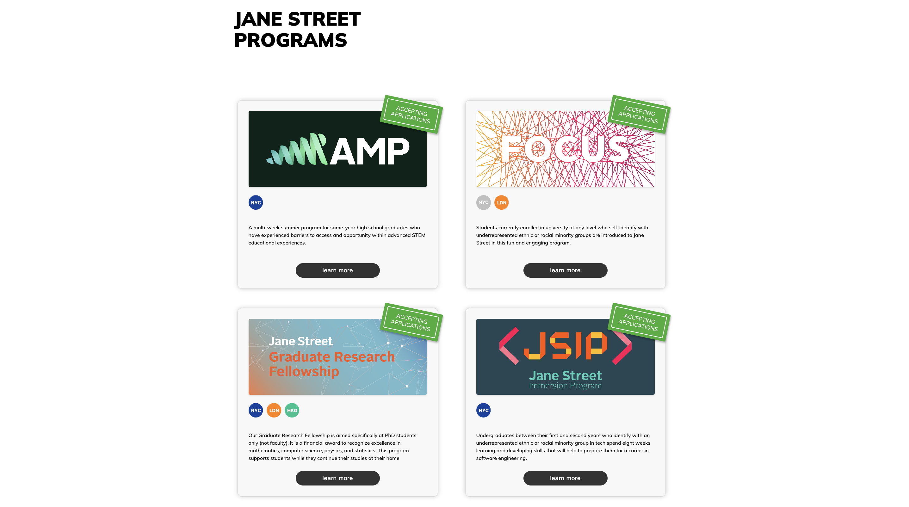

# Jane Street Responsive Web Page

## Project Overview

This project involved creating a responsive web page for Jane Street's Creative Engagement team. The task required transforming a Figma mockup into a functional and visually accurate webpage using HTML, SCSS, and JavaScript. The page dynamically renders program cards using data from a JSON file, sorted based on application status and program name, with a focus on responsive design and interactive elements.

## Features

- **Dynamic Rendering:** Populated program cards dynamically using JSON data.
- **Responsive Design:** Ensured usability across devices with flexible layouts.
- **Accurate Styling:** Matched the Figma mockup design using SCSS for styling.
- **Interactive Elements:** Added hover animations and UI transitions for better user experience.
- **Custom Sorting:** Programs are sorted by application status and name, with internships always last among active applications.

## Technologies Used

- **HTML**: Structured the webpage content.
- **SCSS**: Styled the page with reusable and maintainable stylesheets.
- **JavaScript (with jQuery)**: Handled dynamic rendering and interactivity.
- **CodePen**: Used as the development and deployment platform.
- **Figma**: Referenced for UI mockup design.

## Example Output

A responsive webpage displaying program cards with:

- Banner images
- Location badges
- Descriptions
- "Learn More" buttons
- Application status stamps for active programs

## Future Improvements

- Add a mobile-specific design for enhanced usability.
- Incorporate more advanced animations for a smoother UI experience.
